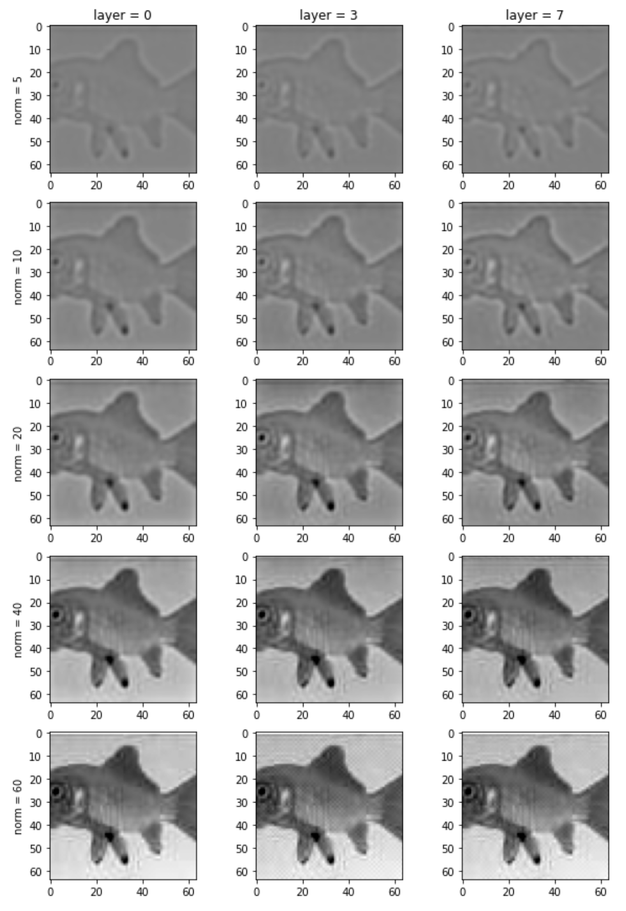

# reconstruction

Toolbox for reconstructing images based on the activations of deep neural network models. 
Uses PyTorch, DataJoint, nnfabrik, and the neuralpredictors package.

Example activation of a target image from an intermediate layers of a VGG19 for different contrast budgets.

